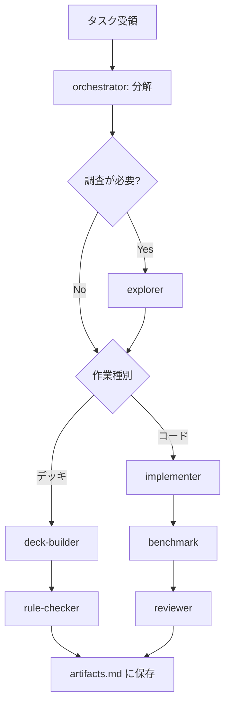

# オーケストレーション（Claude Code）

Claude Code（Cursor）向けのモデル割当とサブエージェント起動方針。
Codex CLI 向けは `.codex/agents/` を参照。

## 利用可能モデル

| ツール | モデル |
|--------|--------|
| Codex CLI | gpt-5.5, gpt-5.4, gpt-5.4-mini |
| Claude Code | Claude Opus, Sonnet, Haiku |

## Claude サブエージェントとモデル

| エージェント | モデル | 用途 |
|-------------|--------|------|
| orchestrator | Claude Opus | 設計判断・タスク分解・委譲 |
| explorer | Claude Haiku | 高速ファイル検索・CSV grep |
| implementer | Claude Sonnet | バランス型コーディング |
| deck-builder | Claude Opus | 戦略コンセプト・勝ち筋設計 |
| rule-checker | Claude Haiku | チェックリスト型ルール検証 |
| reviewer | Claude Opus | 提出前の深いレビュー |
| benchmark | Claude Haiku | テスト・ベンチコマンド実行 |

定義ファイル: `.claude/agents/*.md`

## 起動フロー

## 起動パターン

1. **調査** → explorer（Haiku）
2. **デッキ変更** → deck-builder（Opus）→ rule-checker（Haiku、並列可）
3. **エージェント改修** → implementer（Sonnet）→ benchmark（Haiku）→ reviewer（Opus）
4. **完了** → `.claude/rules/artifacts.md` に従い保存

## Codex との使い分け

| 作業 | 推奨ツール | 理由 |
|------|-----------|------|
| 大量自己対戦ログ分析 | Codex benchmark | gpt-5.4-mini で高速・低コスト |
| エージェント実装の反復 | Codex implementer | workspace-write + 並列 spawn |
| 戦略レポート・設計判断 | Claude Opus | 対話・計画に強い |
| デッキコンセプト立案 | Claude deck-builder | 戦略的推論 |
| ルールチェック | どちらも可 | Haiku / gpt-5.4-mini で十分 |
| 提出前レビュー | Claude reviewer | 深い推論が必要な最終確認 |

## 完了時の必須アクション

1. 変更内容を1段落で要約
2. `.claude/rules/artifacts.md` の該当パスに保存
3. `findings.md` または `docs/decisions/` に「なぜ」を3行以内で記録
