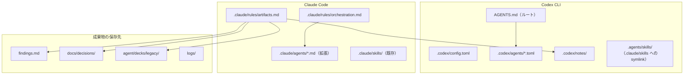

# .codex / .claude 設定整備プラン

## 方針（ユーザー回答の反映）

| 項目 | 決定内容 |
|------|----------|
| AGENTS.md に含める | コンペ絶対ルール + プロジェクト構造のみ |
| オーケストレーション | Codex / Claude 両方に書くが、ツール特性に合わせて役割・モデルを変える |
| サブエージェント | コンペ勝利に最適な構成をこちらで提案（下記） |
| 成果物保存 | 用途別ルールを新設（下記「成果物保存ポリシー」） |

---

## 作成・更新するファイル一覧



### 新規作成

| ファイル | 役割 |
|----------|------|
| [`AGENTS.md`](AGENTS.md) | Codex 自動読み込み。既存 [`CLAUDE.md`](CLAUDE.md) の「コンペ絶対ルール」「プロジェクト構造」「よく使うコマンド」を要約（重複は [`CLAUDE.md`](CLAUDE.md) を fallback として参照） |
| [`.codex/config.toml`](.codex/config.toml) | プロジェクト信頼・マルチエージェント有効化・`CLAUDE.md` fallback・`max_threads=4` |
| [`.codex/agents/orchestrator.toml`](.codex/agents/orchestrator.toml) | タスク分解・他エージェント起動・成果物保存指示 |
| [`.codex/agents/explorer.toml`](.codex/agents/explorer.toml) | 読み取り専用調査 |
| [`.codex/agents/implementer.toml`](.codex/agents/implementer.toml) | コード実装・修正 |
| [`.codex/agents/deck-builder.toml`](.codex/agents/deck-builder.toml) | デッキ設計（既存 [`.claude/agents/deck-builder.md`](.claude/agents/deck-builder.md) と同等制約） |
| [`.codex/agents/rule-checker.toml`](.codex/agents/rule-checker.toml) | コンペルール違反チェック |
| [`.codex/agents/reviewer.toml`](.codex/agents/reviewer.toml) | 提出前レビュー |
| [`.codex/agents/benchmark.toml`](.codex/agents/benchmark.toml) | pytest / 自己対戦ベンチ実行 |
| [`.claude/rules/orchestration.md`](.claude/rules/orchestration.md) | Claude 向けモデル割当・起動条件 |
| [`.claude/rules/artifacts.md`](.claude/rules/artifacts.md) | 成果物保存ルール（Codex / Claude 共通） |
| [`docs/decisions/README.md`](docs/decisions/README.md) | 設計判断の索引（001-xxx.md 形式） |
| [`.agents/skills/`](.agents/skills/) | Codex 用スキル（[`.claude/skills/`](.claude/skills/) への symlink） |

### 更新

| ファイル | 変更内容 |
|----------|----------|
| [`.claude/agents/deck-builder.md`](.claude/agents/deck-builder.md) | モデル指定（Opus）・成果物保存先・`explore/visualize_deck.py` 実行指示を追記 |
| [`.claude/agents/rule-checker.md`](.claude/agents/rule-checker.md) | モデル指定（Haiku）・チェックリスト強化 |
| 新規 [`.claude/agents/orchestrator.md`](.claude/agents/orchestrator.md) | Claude オーケストレーター |
| 新規 [`.claude/agents/implementer.md`](.claude/agents/implementer.md) | Sonnet 向け実装エージェント |
| 新規 [`.claude/agents/reviewer.md`](.claude/agents/reviewer.md) | Opus 向けレビュー |
| 新規 [`.claude/agents/benchmark.md`](.claude/agents/benchmark.md) | Haiku 向けテスト実行 |
| [`CLAUDE.md`](CLAUDE.md) | オーケストレーション概要・成果物保存・`.codex` との関係を短く追記 |

---

## AGENTS.md の内容（実装前に最終確認）

ユーザー選択に基づき、以下 **2 セクションのみ** を書く（それ以外は別ファイルへ）:

1. **コンペ絶対ルール** — [`CLAUDE.md`](CLAUDE.md) L19-24 + [`.claude/rules/competition.md`](.claude/rules/competition.md) の要点
2. **プロジェクト構造・コマンド** — [`CLAUDE.md`](CLAUDE.md) L12-17, L26-32

末尾に「詳細は `CLAUDE.md` / `.claude/rules/` / `.codex/agents/` を参照」とリンク。

---

## オーケストレーション設計（ツール別）

### Codex CLI（`.codex/agents/`）

Codex は OpenAI モデルのみ。サブエージェントは **プロンプトで明示的に spawn** する前提。

| エージェント | モデル | sandbox | 用途 |
|-------------|--------|---------|------|
| orchestrator | **gpt-5.5** | workspace-write | 分解・割当・並列 spawn・成果物保存指示 |
| explorer | **gpt-5.4-mini** | read-only | コードベース調査・CSV 参照 |
| implementer | **gpt-5.4-mini** | workspace-write | `agent/*.py` 実装（高速・大量） |
| deck-builder | **gpt-5.4** | read-only | カード相性分析・60枚デッキ設計 |
| rule-checker | **gpt-5.4-mini** | read-only | 60枚/4枚制限/タイムアウト/CSV 参照チェック |
| reviewer | **gpt-5.4** | read-only | 提出前の correctness / クラッシュ耐性 |
| benchmark | **gpt-5.4-mini** | workspace-write | `pytest`, `explore/run_match.py`, `step3_deck_check.py` |

**orchestrator の developer_instructions に書く起動パターン例:**

```
1. 調査 → explorer を spawn
2. デッキ変更 → deck-builder → rule-checker（並列可）
3. エージェント改修 → implementer → benchmark → reviewer
4. 完了時 → artifacts.md に従い保存
```

[`.codex/config.toml`](.codex/config.toml):

```toml
project_doc_fallback_filenames = ["CLAUDE.md"]
project_doc_max_bytes = 65536

[features]
multi_agent = true

[agents]
max_threads = 4
max_depth = 1
```

### Claude Code（`.claude/`）

Cursor / Claude Code では Claude モデルを使用。Codex より **対話・計画** に強みがあるため役割を少しずらす。

| エージェント | モデル | 用途 |
|-------------|--------|------|
| orchestrator | **Claude Opus** | 大きな設計判断・タスク分解・他エージェントへの委譲指示 |
| explorer | **Claude Haiku** | 高速なファイル検索・CSV grep |
| implementer | **Claude Sonnet** | バランス型コーディング（`agent/main.py` 等） |
| deck-builder | **Claude Opus** | 戦略コンセプト・勝ち筋設計 |
| rule-checker | **Claude Haiku** | チェックリスト型ルール検証 |
| reviewer | **Claude Opus** | 提出前の深いレビュー |
| benchmark | **Claude Haiku** | テスト・ベンチコマンド実行 |

[`.claude/rules/orchestration.md`](.claude/rules/orchestration.md) に「いつどのエージェントを使うか」のフローチャートと、**Codex との使い分け**（例: 大量自己対戦ログ分析は Codex benchmark、戦略レポート執筆は Claude Opus）を記載。

---

## 成果物保存ポリシー（提案）

[`.claude/rules/artifacts.md`](.claude/rules/artifacts.md) に共通ルールとして定義し、各 orchestrator の指示にも参照させる。

| 成果物の種類 | 保存先 | 命名規則 | 例 |
|-------------|--------|----------|-----|
| デッキ案 | [`agent/decks/legacy/`](agent/decks/legacy/) | `YYYY-MM-DD_<concept>.csv` | 既存 `2026-06-18_kyogre-snover-water.csv` |
| 提出デッキ確定 | [`agent/deck.csv`](agent/deck.csv) | 上書き（rule-checker 通過後のみ） | — |
| 検証・実験結果 | [`findings.md`](findings.md) | 日付見出しで追記 | STEP 4 形式を踏襲 |
| 設計判断（ADR） | [`docs/decisions/`](docs/decisions/) | `NNN-<topic>.md` | `001-mcts-timeout-strategy.md` |
| セッション要約 | [`.codex/notes/`](.codex/notes/) | `YYYY-MM-DD-<topic>.md` | Codex セッションの要点 |
| ベンチ・自己対戦ログ | [`logs/`](logs/) | 既存 JSONL 形式 | `self_play_10k.jsonl` |
| デッキ可視化 | [`explore/deck_visualization/`](explore/deck_visualization/) | gitignore 対象（既存） | `deck.html` |

**エージェント完了時の必須アクション**（orchestrator 指示に含める）:

1. 何を変更したか 1 段落で要約
2. 上表の該当パスに保存
3. `findings.md` または ADR に「なぜそうしたか」を 3 行以内で記録

---

## 既存資産の活用

- コンペルール: [`.claude/rules/competition.md`](.claude/rules/competition.md), [`.claude/rules/agent.md`](.claude/rules/agent.md), [`.claude/rules/deck.md`](.claude/rules/deck.md) — AGENTS.md から参照、重複は最小化
- スキル: [`.claude/skills/analyze-card/SKILL.md`](.claude/skills/analyze-card/SKILL.md), [`.claude/skills/build-deck/SKILL.md`](.claude/skills/build-deck/SKILL.md) — `.agents/skills/` に symlink
- 検証記録: [`findings.md`](findings.md) — 実験結果の主保存先として継続利用
- デッキ legacy: [`agent/decks/legacy/`](agent/decks/legacy/) — 既存パターンを正式化

---

## 実装手順

1. `.codex/config.toml` と `AGENTS.md` を作成（内容は上記 2 セクション、実装直前にユーザーへ最終文案を提示）
2. `.codex/agents/` に 7 つの TOML を作成（モデル・sandbox・developer_instructions）
3. `.claude/rules/orchestration.md` と `artifacts.md` を作成
4. `.claude/agents/` を拡張（orchestrator / implementer / reviewer / benchmark 新規、既存 2 件更新）
5. `docs/decisions/README.md` と `.codex/notes/.gitkeep` を作成
6. `.agents/skills/` → `.claude/skills/` の symlink
7. `CLAUDE.md` にオーケストレーション・保存ルールへのリンクを追記
8. `.gitignore` 確認（`.codex/notes/` は commit 可、機密なし）

---

## 実装後の確認

```bash
source env/venv311/bin/activate
python -m pytest tests/
python explore/step3_deck_check.py
```

Codex 側: セッション開始後「Summarize the current instructions.」で AGENTS.md + CLAUDE.md が読まれているか確認。

---

## 確認事項（実装開始前）

実装に入る直前、**AGENTS.md の具体文案**（コンペルール・プロジェクト構造の文言）を提示し、OK をもらってからファイルを書く。
